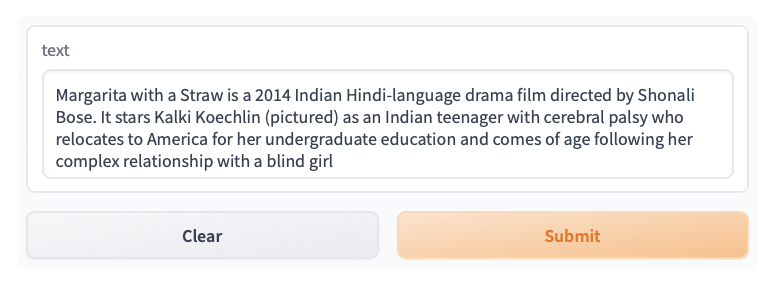
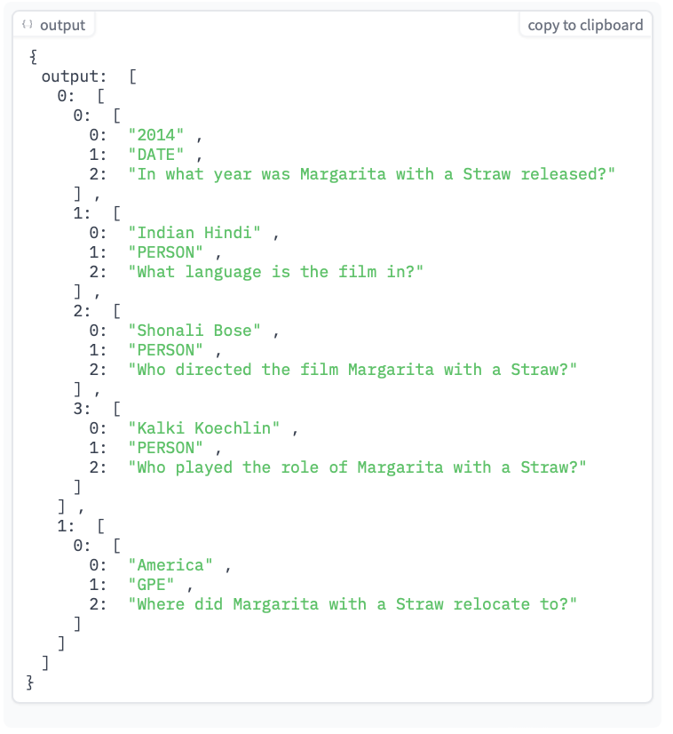
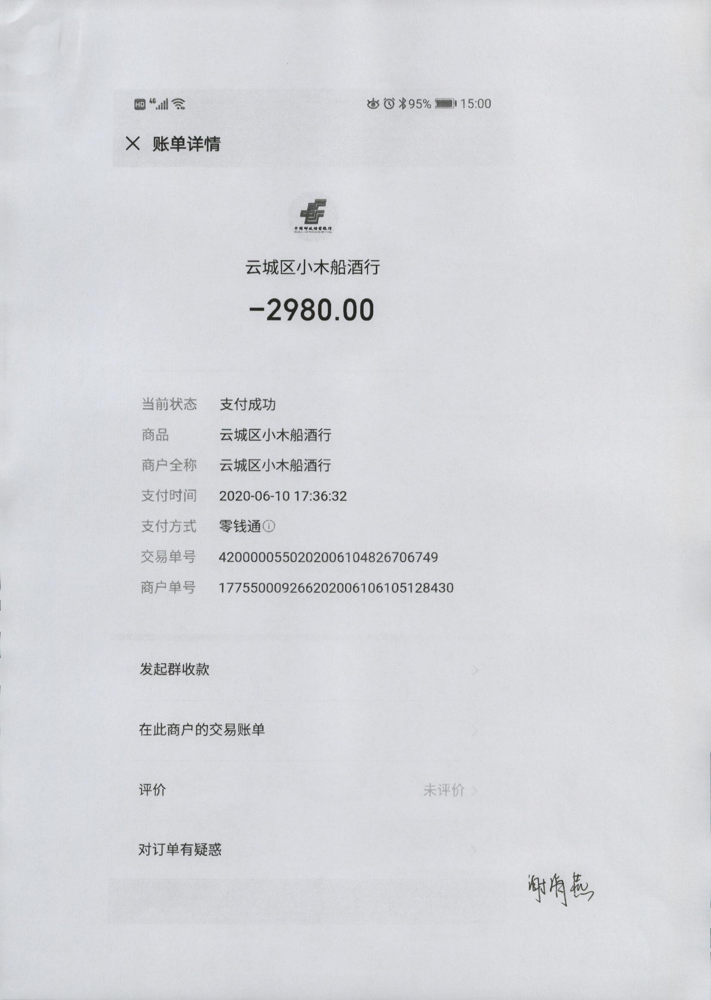
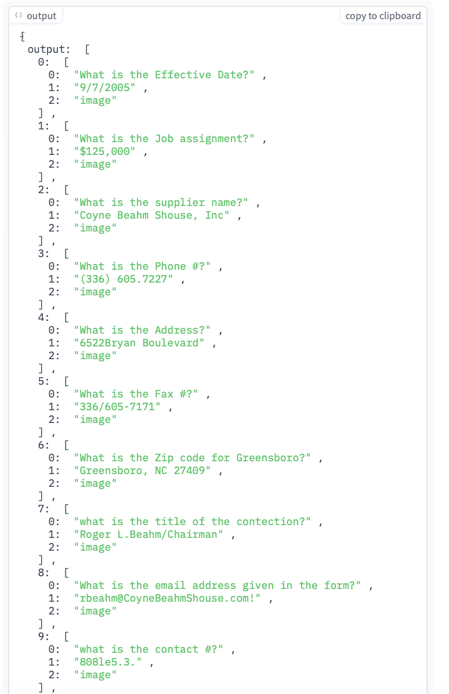
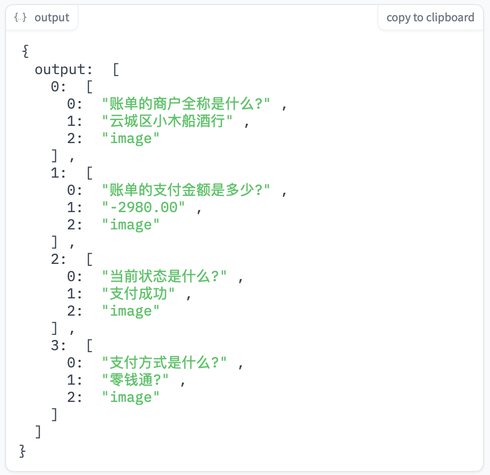

<!-- PROJECT LOGO -->
<br />
<p align="center">
  <h3 align="center">docvqa-gen</h3>

  <p align="center">
   		基于英语和中文文档视觉的问答数据集生成器
    <br />
  </p>
</p>

[In English](README_EN.md)

### 简要引述
现在，许多问答框架都提供了一个用于生成自定义数据集的功能，以支持在数据维度上训练模型。例如，[primeqa](https://github.com/primeqa/primeqa)提供了许多工具包，其中包括多语言问题生成：支持对表格和多语言文本进行有效领域适应的问题生成。而[PaddleNLP](https://github.com/PaddlePaddle/PaddleNLP/tree/develop/examples/question_generation/unimo-text)也在中文NLP领域实现了这个功能。从源代码可以看出，它们可能从一些框架中获得了灵感，例如[text2text](https://github.com/artitw/text2text)。我也是在2022年4月初从[text2text](https://github.com/artitw/text2text)中获取了这个想法。<br/>

由于[PaddleNLP](https://github.com/PaddlePaddle/PaddleNLP/tree/develop/examples/question_generation/unimo-text)不久前发布了这个功能，我认为现在是时候发布一个演示项目，以推广这个功能到OCR领域，并提供一个在图像上生成问题的接口。这是[DocVQA任务](https://www.docvqa.org)的数据组成部分。<br/>

核心是在图像上训练一个问题生成器，如果有人提供答案，这个生成器将给出问题。这个需求可以通过一个名为[donut](https://github.com/clovaai/donut)的多模态框架来满足，在其DocVQA变体中，它可以在图像上执行问答操作。在某些情况下，这个模型的表现不能超过一些带有OCR帮助的框架。<br/>

由于全能构造使得生成器错误无法在不同模块中得到很好的处理，这可能使结论过于依赖训练数据集，并给训练这种模型的图像增强任务带来挑战。<br/>

但是，这并不影响使用[donut](https://github.com/clovaai/donut)来训练问题生成器的方便性。因为[donut](https://github.com/clovaai/donut)中的解码器使用[hyunwoongko/asian-bart-ecjk](https://huggingface.co/hyunwoongko/asian-bart-ecjk)，这使得此框架适用于包括英语、中文、日语和韩语在内的多种语言，而这种优秀模型的开发者主要来自韩国。这为处理ecjk领域中的生成问题生成提供了机会。<br/>

### 最小依赖安装
如果有人只想使用训练好的[donut](https://github.com/clovaai/donut)模型在图像上生成问题。我已经将它们的训练早期停止版本分别上传到了HuggingFace hub的英文和中文领域。您可以从[svjack/question_generator_by_zh_on_pic](https://huggingface.co/svjack/question_generator_by_zh_on_pic)和[svjack/question_generator_by_en_on_pic](https://huggingface.co/svjack/question_generator_by_en_on_pic)下载它们，然后通过以下命令安装[donut](https://github.com/clovaai/donut)：<br/>

```bash
pip install donut-python
```

这将帮助您使用它们。（您可以使用git-lfs下载它们，并使用DonutModel.from_pretrained(en_model_path)来以[donut](https://github.com/clovaai/donut)相同的方式初始化权重）


### 更进一步

在NLP领域中，如果给你一个段落，你怎么能从这个段落中得到一些问题和它们的答案，整个目标可以分成几个模块。

以下是在HuggingFace Space中自行训练和构建的NLP示例部署。<br/>
<b>[问句生成器 🍩 展示](https://huggingface.co/spaces/svjack/Question-Generator)</b>


#### 在段落上的问句生成器例子展示
<table><caption></caption>
<tbody>
<tr>
<td>文本对应的图片</td>
<td></td>
<td></td>
</tr>
<tr>
<td>生成的问答对</td>
<td></td>
<td></td>
</tr>
</tbody>
</table>

首先，确定人们主要感兴趣的问题答案类型。一个常用的NLP任务可以解决这个问题——命名实体识别（NER），在许多话题中，人们主要关心命名实体，因此许多数据集都是以NE为中心构建的。因此，您可以将命名实体提取为答案。如果答案来自文本，则需要原生的NER。<br/>

<b>当涉及到图像时</b>，可以使用[PaddleOCR](https://github.com/PaddlePaddle/PaddleOCR)的[kie module](https://github.com/PaddlePaddle/PaddleOCR/tree/release/2.6/ppstructure/kie)模块在[PPStructure](https://github.com/PaddlePaddle/PaddleOCR/tree/release/2.6/ppstructure)中进行命名实体识别。<br/>

其次，使用生成器生成关于这个答案的问题。<br/>

<b>当涉及到图像时</b>，这是在[donut](https://github.com/clovaai/donut)的帮助下完成的，但由于数据集的变化，当图像由一些长段落构成时，donut问题生成器可能无法正常工作。因此需要通过OCR提取长段落，并在OCR识别出的段落中生成问题。在英文领域，[text2text](https://github.com/artitw/text2text)通过其Handler处理它，而我发布了我的[svjack/squad_gen_qst_zh_v0](https://huggingface.co/svjack/squad_gen_qst_zh_v0)可以用于中文。<br/>

第三，使用SQuAD样式模型验证生成的问题。<br/>

<b>当涉及到图像时</b>，需要验证由[donut](https://github.com/clovaai/donut),生成器和文本生成器生成的问题。这需要一个支持在英语和中文文档图像上执行问答的模型。这可以通过[PaddleNLP](https://github.com/PaddlePaddle/PaddleNLP)的[文档智能模块](https://github.com/PaddlePaddle/PaddleNLP/tree/develop/model_zoo/ernie-layout)进行实现。<br/>

在上述讨论之后，从段落生成问题的任务已经升级为文档图像生成问题。PaddleNLP和PaddleOCR对从donut出发提供了这种改进以支持——只需要一个生成器<b>"更进一步"</b>，它在英语和中文方面具有兼容性。而且，DocVQA数据集的生成已经在理论上完成。<br/>

### 完全依赖安装

如果想要使用"一步到位"的功能从文档图像中生成问题和答案，除了[donut](https://github.com/clovaai/donut)之外，您还需要安装用于执行命名实体识别（NER）的模型（我选择了spacy），并下载一些必需的模型文件到本地。为了简化安装过程，在[notebook.ipynb](notebook.ipynb)中，它集成了每个安装步骤并在一个小的jupyter笔记本中运行演示。您可以在任何良好的网络连接的笔记本服务器上运行此notebook（如Kaggle Colab或您的本地jupyter服务器）。<br/>
或者您可以通过requirements.txt安装python包

```bash
pip install -r requirements.txt
```

然后通过packages.txt下载apt-get依赖项到本地，下载[svjack/question_generator_by_zh_on_pic](https://huggingface.co/svjack/question_generator_by_zh_on_pic)和[svjack/question_generator_by_en_on_pic](https://huggingface.co/svjack/question_generator_by_en_on_pic)。

在Huggingface Space上部署的示例（在上述第三步中没有进行验证）

<!--
<b>[文档图像上的问题生成🍩演示](https://huggingface.co/spaces/svjack/Question-Generator-On-Documnet-Image)</b>
-->

#### 文档问句生成描述
<table><caption></caption>
<tbody>
<tr>
<td>图片</td>
<td></td>
<td></td>
</tr>
<tr>
<td>上面图片生成的问答对</td>
<td></td>
<td></td>
</tr>
</tbody>
</table>


### 手动运行的例子
因为在项目中路径是固定的，所以所有检查示例的函数都应该在项目的根目录中运行。
我建议在检查示例之前先运行[notebook.ipynb](notebook.ipynb)以完成安装。
在使用它们之前，请检查[imgs](imgs)文件夹中的内容。

#### 手动设定答案的问句生成
* 1
```python
from qa_on_image import *
img_path = "imgs/en_img.png"
input_img = read_img_to_3d_array(img_path)
demo_process_vqa(input_img, "605-7227", "en")
```
将会给出这些输出:
```json
{'question': '605-7227', 'answer': 'What is the Phone #?'}
```
* 2
```python
from qa_on_image import *
img_path = "imgs/zh_img.png"
input_img = read_img_to_3d_array(img_path)
demo_process_vqa(input_img, "零钱通", "zh")
```
将会给出这些输出:
```json
{'question': '零钱通', 'answer': '支付方式是什么?'}
```

#### 更进一步的 (在图片上生成问句) 例子
* 1
```python
from qa_on_pic import *
img_path = "imgs/en_img.png"
qa_df = generate_qa(img_path, ppstructure_bin_path, table_engine)
qa_df.values.tolist()
```
将会给出这些输出:
```json
[['What is the supplier name?', 'Coyne Beahm Shouse, Inc', 1.0, 'image'],
 ['What is the Address?', '6522 Bryan Bouievard', 1.0, 'image'],
 ['What is the Phone #?', '(336) 605-7227', 0.99, 'image'],
 ['What is the Effective Date?', '9/7/2005', 0.97, 'image'],
 ['What was the other name of the other Supplier Name?',
  'Coyne Beahm Shouse, Inc',
  0.97,
  'context'],
 ['What must be included in the contract?',
  'signed Bid Waiver',
  0.91,
  'context'],
 ['What is the number of the street number in the city?', '1', 0.8, 'context'],
 ['What is the job assignment?', '9/7/2005', 0.59, 'image']]
```

* 2
```python
from qa_on_pic import *
img_path = "imgs/zh_img.png"
qa_df = generate_qa(img_path, ppstructure_bin_path, table_engine)
qa_df.values.tolist()
```
将会给出这些输出:
```json
[['账单的商户全称是什么?', '云城区小木船酒行', 1.0, 'image'],
 ['当前状态是什么?', '支付成功', 1.0, 'image'],
 ['支付方式是什么?', '零钱通', 0.99, 'image'],
 ['账单的支付金额是多少?', '2980.00', 0.85, 'image']]
```

* 3
```python
from qa_on_pic import *
img_path = "imgs/en_context.png"
qa_df = generate_qa(img_path, ppstructure_bin_path, table_engine)
qa_df.values.tolist()
```
将会给出这些输出:
```json
[['When must the payment terms be completed?',
  'prior to September 1, 1994',
  1.0,
  'context'],
 ['How often are Safeway" Hot Shoe" awards provided?',
  'annual',
  0.88,
  'context'],
 ['Who received $ 200 in Safeway Gift Certificates?',
  'Winner',
  0.82,
  'context']]
```

* 4
```python
from qa_on_pic import *
img_path = "imgs/zh_context_1.png"
qa_df = generate_qa(img_path, ppstructure_bin_path, table_engine)
qa_df.values.tolist()
```
将会给出这些输出:
```json
[['公司何时发布《发行股份及支付现金购买资产并募集资金汇合备', '2018年12月27日', 1.0, 'context'],
 ['中金黄金在购买其持有的矿业', '90%股权', 0.96, 'context'],
 ['右下角的数字是什么?', '2020', 0.88, 'image'],
 ['该图中的人民币是指什么?', '当前价', 0.82, 'image'],
 ['谁为其持有的矿业股份 并获得其持有的矿业股份?', '中金黄金', 0.55, 'context']]
```

## Contact

<!--
Your Name - [@your_twitter](https://twitter.com/your_username) - email@example.com
-->
svjack - svjackbt@gmail.com - ehangzhou@outlook.com

<!--
Project Link: [https://github.com/your_username/repo_name](https://github.com/your_username/repo_name)
-->
Project Link:[https://github.com/svjack/docvqa-gen](https://github.com/svjack/docvqa-gen)<br/>

HuggingFace 空间链接:<br/>
[https://huggingface.co/spaces/svjack/Question-Generator-On-Documnet-Image](https://huggingface.co/spaces/svjack/Question-Generator-On-Documnet-Image)<br/>
[https://huggingface.co/spaces/svjack/Question-Generator](https://huggingface.co/spaces/svjack/Question-Generator)


<!-- ACKNOWLEDGEMENTS -->
## Acknowledgements
<!--
* [GitHub Emoji Cheat Sheet](https://www.webpagefx.com/tools/emoji-cheat-sheet)
* [Img Shields](https://shields.io)
* [Choose an Open Source License](https://choosealicense.com)
* [GitHub Pages](https://pages.github.com)
* [Animate.css](https://daneden.github.io/animate.css)
* [Loaders.css](https://connoratherton.com/loaders)
* [Slick Carousel](https://kenwheeler.github.io/slick)
* [Smooth Scroll](https://github.com/cferdinandi/smooth-scroll)
* [Sticky Kit](http://leafo.net/sticky-kit)
* [JVectorMap](http://jvectormap.com)
* [Font Awesome](https://fontawesome.com)

* [Stable Diffusion](https://stability.ai/blog/stable-diffusion-public-release)
* [diffusers](https://github.com/huggingface/diffusers)
* [diffusiondb](https://github.com/poloclub/diffusiondb)
* [Taiyi-Stable-Diffusion-1B-Chinese-v0.1](IDEA-CCNL/Taiyi-Stable-Diffusion-1B-Chinese-v0.1)
* [prompt-extend](https://github.com/daspartho/prompt-extend)
* [EasyNMT](https://github.com/UKPLab/EasyNMT)
* [Stable-Diffusion-Pokemon](https://github.com/svjack/Stable-Diffusion-Pokemon)
* [svjack](https://huggingface.co/svjack)
-->
* [text2text](https://github.com/artitw/text2text)
* [donut](https://github.com/clovaai/donut)
* [primeqa](https://github.com/primeqa/primeqa)
* [DocVQA task](https://www.docvqa.org)
* [spacy](https://github.com/explosion/spaCy)
* [PaddleNLP](https://github.com/PaddlePaddle/PaddleNLP)  
* [PaddleOCR](https://github.com/PaddlePaddle/PaddleOCR)
* [EasyNMT](https://github.com/UKPLab/EasyNMT)
* [svjack](https://huggingface.co/svjack)
